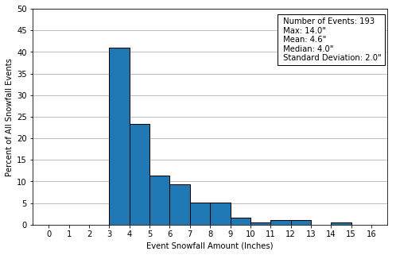
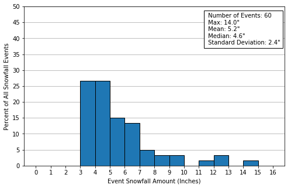

<header>
Things to Do
============
</header>

## Capstone:  
# Utilizing Meteorological Data with Supervised Learning to Predict Snowfall Amounts at Ski Resort
**By Dustin Rapp**  

--  
--  

## Capstone:  
# Utilizing Meteorological Data with Supervised Learning to Predict Snowfall Amounts at Ski Resort
**By Dustin Rapp**  

--  
--  

## Introduction
***
Complex terrain in mountainous areas often make predicting snowfall difficult with prognostic weather models - especially on specific slopes or mountainsides where extremely localized air flows may complicate such forecasts.  With accurate snow forecasts, ski resorts can optimize their snowfall making, grooming, and snow removal operations. An accurate short term snowfall forecast, even for a small segment of the mountain may likely assist a ski resort's operation.  The goal of this study is to get a glimpse into the potential of utilizing a supervised learning techniques with freely available surface and meteorological data to predict snowfall on a slope at Copper Mountain Ski Resort in Colorado.  Copper Mountain Ski Resort may be especially interested in such predictive models because of the unique access to government funded meteorological data being recorded near or onsite to their resort.  The purpose of this report is to describe an assessment with Ordinary Least Squares Model (OLS) to predict snowfall totals over a 12 hour timespan, utilizing some of these meteorological measurements.

In the following sections, details regarding how the data was obtained, cleaned and and model analyses are described.  A discussion surrounding model setup, model performance, and potential model improvements then follows. Finally, Recommendations for future work is provided.  

## Data
The Copper Mountain ski resort is unique as snow depth is continuously monitored by an official SNOTEL National Resources Conservation Service (NRCS) monitoring station on the north slope of Copper Mountain, where many popular ski runs are located. SNOTEL is a telemetry automated system of snowpack and related climate sensors in the Western United States. In addition to reporting hourly snowfall amounts, it also records temperature.  The Copper Mountain ski resort also has a Colorado Department of Transportation Automated Weather Observing System (AWOS) which monitors a suite of hourly meteorological variables near the top of on-site Copper Mountain.  Additionally, a National Weather Service Automated Surface Observing Station (ASOS) is located in Leadville, CO approximately 30 km to the northwest of Copper Mountain.  These three stations give a comprehensive meteorological dataset of surface variables in the vicinity of the Copper Mountain Resort.  Hourly data was obtained from each of these sites from government websites.  

Since snowfall amounts are also often associated meteorological conditions in the upper atmosphere and could be beneficial to the model, upper air data from the Grand Junction, CO radiosonde station was also obtained.   As weather balloons are launched every 12 hours, hourly upper air data is not available, and concurrent upper air data contained observerations every 12 hours.

 **Table 1** gives a listing of all surface level and upper air meteorological variables by station. Hourly data for each surface station was downloaded for years 2005-2017 from online sources.  Data sources for each station are found in **Table 2**.  A map showing the Copper Mountain SNOTEL site and the meteorological sites used in this assessment is also shown in **Figure 1.**  Throughout the remainder of the document, the Station IDs shown in **Table 1** will be used to identify specific stations.  
  

 **Table 1 - Meteorological Variables by Station**  
 

|**Station ID/Num** |**Station Type**   |**Elevation**   |**Variables**     | **Data Source**   |  
|:-----------------:|:-----------------:|:----------------:|:--------------:|:-----------------:|
| **SNOTEL 415**    | SNOTEL    |10550'     | Surface Temperature   Surface Snow Depth       |   National Resources   Conservation Service   (www.NRCS.gov)
| **KLXV**          | ASOS      |12075      | Surface Wind Speed   Surface Wind Direction   Surface Pressure   Cloud Cover| National Climatic   Data Center   ISHD Lite format   (www.NCDC.gov) 
| **KCCU**          | AWOS      |10550'     | Surface Dewpoint   Surface Wind Direction   Surface Wind Speed   Surface Wind Direction   <Surface Pressure   Cloud Cover| National Climatic   Data Center   ISHD Lite format   (www.NCDC.gov) 
|**KJCT**           | RAOB      | n/a       | 200mb, 250mb, 300mb, 400mb, 500mb, 700mb, & 850mb Height    200mb, 250mb, 300mb, 400mb, 500mb, 700mb, & 850mb Temperature    200mb, 250mb, 300mb, 400mb, 500mb, 700mb, & 850mb Dewpoint     200mb, 250mb, 300mb, 400mb, 500mb, 700mb, & 850mb Wind Speed  
200mb, 250mb, 300mb, 400mb, 500mb, 700mb, & 850mb Wind Direction
  

***  

  ***
**Figure 1 - Map of SNOTEL and KCCU Station Locations at Copper Mountain Ski Report**  

 
KXLV site relative to Copper Mountain Ski Resort            |  Relative locations of the SNOTEL and KCCU sites at the Copper Mountain Ski Resort |
:---------------------------------------------------------- |:----------------------------------------------------------------------------------:|
                                          |                                                     

  

  

## Data Wrangling and Cleaning
Before the raw data could be utilized for analysis or modeling purposes, it did require some cleaning and post processing.  All data was downloaded in an tab delimited or comma separated (csv) format with timestamps.  The following sections discuss the steps used to clean/wrangle the data into a usable format.

### Data Organization
Hourly surface data and 12-hr upper air data from each was station, downloaded, organized and combined into a single timeseries dataframes with UTM timestamps.  

The following cleanup steps were performed on this dataset:

* While the KCCU and KXLV datasets were already in UTM time, the NRCS dataset was in local time and required conversion to UTM.   
* The KCCU and KXLV datasets are in the Integrated Surface Hourly Data (ISHD) format and did require some manipulation (e.g. divided by 10) to get values into typical units. 
* Missing values (e.g. 9999 values) were translated to NaN values.
* Missing data for all variables was linearly interpolated for time periods where 3 hours or less of data was missing. 

The data was plotted to see if there were any extreme values warranting removal or concern.  It was noted that some of the KCCU data (especially temperature) did not demonstrate as much of a diurnal variation as the KXLV station.  While these data are considered suspicious but were not removed from the dataset.  A more robust quality control of this dataset is outside the scope of this preliminary study, but should be considered for future studies.  Also, a very small amount of anomalous data was observed in the SNOTEL snow depth data and was removed.  These physically unrealistic readings (e.g. spikes in some of the snow depth data or snowdepth reports which occur when temperatures did not support snowfall) were removed as well as extreme negative values. This cleanup can be found [here](url_here)

### Additional Calculations

**Pressure**  
Changes in pressure are often a predictive indicator of weather conditions (i.e. pressure drops often accompany strong storm systems), a twelve hour pressure change variable was added to the datset.  This was calculated by subtracting the 00:00 observation from the upcoming 12:00 observation.

**Snowfall**    
As the SNOTEL-415 data only includes snow depth data instead of snowfall data, snowfall was calculated based on changes in snowdepth.  However, it was noted that snow depth data from the SNOTEL site appeared extremely noisy, and it was difficult to assess whether 1-2" inches changes in snow depth measurements were real snowfall events.   This noise is likely due to the sensitivity of the SNOTEL snow depth measurement sensors to external forces (e.g. debris, animals, blowing snow).  To minimize the small scale perturbations found in the data, 12 hour snowfall totals were estimated at 00:00 UTC and 12:00 UTC and only 12-hr snowfall events where greater then or equal to 3 inches occurred were considered a snowfall event.  The snowfall data was then added to meteorological dataframe.   

Because only 00:00 and 12:00 snowfall observations were utilized in the analysis, all variables in the meteorological dataframe were reduced from hourly observations to twelve hour observations.  A new dataframe was created utilizing only 00:00 and 12:00 observations.

A table showing the total number of snowfall events, along with mean, max, and standard deviation of snowfall for each year is found in **Table 3**.  A timeseries plot showing the snowdepth, along with these snowfall events is found in **Figure 2**.
  

***

**Table 3  Annual Statistics of 12-hr Snowfall Events (>=3")**  

***

**Figure 2  Timeseries of snow depth and snowfall events**  
 

  

  

  

***  

  
.

# Ordinary Least Squares Model
***

Once the data was cleaned and processed, a linear regression analysis was performed on each feature in the dataset to better understand each features' relationship with snowfall.  For each potential variable, data was plotted against snowfall amounts which would occur over the next 12 hours.    Slope, standard error, R square values, along with p values were calculated for all variables. This analysis can be found [here](url_here) 

Based on calculated linear regression statistics, the features determined to most likely be the most important features for an OLS snowfall prediction model included dewpoint, KCCU Wind Speed, and pressure changes based on linear fit statistics.  While the predictive capability of any individual variable appeared to be low, it is thought still worthwhile exploring whether multiple linear regression could be used in conjunction with the the numerous features to predict snowfall.  An Ordinary Least Squares (OLS) model was chosen as it is a straightforward methodology which attempts to minimize standard square errors for all selected features.  The following subsections discuss the test/training partitioning methodology, features selected for model, model performance, as well as a discussion of this performance.

##  Test/Training Partitioning

For any OLS model, the model must be appropriately trained and tested.  To train the model, the select snowfall event data was partitioned such that approximately 80% of the data was used for training. The remaining 20% of the data was used for testing purpose.  Two different test/train partitions were made based on time and considering individual year statistics found in **Table 1**:
* **Partition A:** Data in years 2006 and 2017 were used as the testing set, while years (2007-2016) of the meteorological datasets were used as the training set
* **Partition B:** Data in year 2014 was used as the testing set, while the remaining years (2006-2013, 2015-2017) were used as the training set

These annual divisions were based on an analysis of usable snowfall events by year. These split gave nearly an 80/20 split, as well as integrate some larger snowfall events into both the test and training sets.  This analysis can be found [here](url_here)

##  OLS Model Feature Selection 

Utilizing the statsmodel api with the meteorological datasets, the OLS function was utilized to determine best fit parameters for a OLS model.  Two different analyses were performed on each of the two training partitions - one only utilizing surface meteorological variables, and the other utilizing both upper air and surface variables.  This resulted in a total four training dataset.  For each training set, a forward stepwise approach was used using the adjusted R squared value as the metric to determine the combination of features which would likely optimize model performance. To perform forward stepwise iterations, each model was first fitted using a single predictor features. Predictor features were then added to the model one at the time. With each feature addition, a new adjusted R squared value was calculated at each step.  If the feature addition resulted in a larger adjusted R squared, the feature was retained; otherwise it was discarded. At the end of the steps, the combination of features which gave the highest predictive value to the model were theoretically found.

Of the combination of features determined for each training dataset, it was observed that individual feature t-statistic confidence intervals (p values) were high for some features, indicating that the likelihood of a good linear relationship is not significant for those features. Using the combinations of features obtained during from the forward stepwise analysis, the OLS model was iterively rerun testing different p-value thresholds for which to remove features.  Features which exceeded the p value threshold were eliminated and an adjusted R squared was calculated to see if model improvement could be made through removal of some of the features with high p values. Removal of some of these features did result in some very small improvements to adjusted R squared values for some of the training datasets.

For each training dataset, the combination of features which ultimately resulted in the highest adjusted R squared values are found in **Table 2** and **Table 3**.  Note that while the adjusted R-squared is small, the F-statistics probability is significant (<0.02) for Surface Data only cases, and <0.005 for the Surface+Upper Air Data cases. This is important to note as it indicates that linear relationships developed in these modeled is likely not by chance, and there is potentially some predictive skill.

#### Table 2 - Statistics Obtained Using  Partition A Training Data 

|Dataset                   |  R-squared  |  Adj. R-squared: |   F-statistic:  |    Prob (F-statistic):  |   Combination of Best Fit Features in  OLS  | Link to Analysis |
|:---------------------------:|:-----------:|:----------------:|:---------------:|:-----------------------:|:--------------------------------------------------------------------------------------------:|
|Surface Data Only          |  0.060      | 0.044            |   3.765         |0.0118                   |  LXV 12hr delta Pressure,   CMtn Dewpoint,   CMtn WindSpeed | [Analysis Link](url_here)
| Surface+Upper Air Data   |  0.191      |   0.129         |     3.087     |0.000606            |   400mb-250mb Dewpoint,    CMtnSNTL Temperature,    *CMtnSntl Temperature*,     *LXV 12hr delta Pressure*,    *400-200mb Dewpoint*,    *700mb Wind Direction*,   500mb-300mb Wind Direction,    CMtn Dewpoint,    250mb Temperature,   250-200mb Dewpoint,   300-250mb Wind Direction,    400-200mb Temperature,    CMtn Wind Speed,   500-200mb height  |  [Analysis Link](url_here)

 
  
 ***  
#### Table 3 - Statistics Obtained Using Parition B Training Data 

|Dataset                   |  R-squared  |  Adj. R-squared: |   F-statistic:  |    Prob (F-statistic):  |   Combination of Best Fit Features in  OLS  | Link to Analysis |
|:---------------------------:|:-----------:|:----------------:|:---------------:|:-----------------------:|:--------------------------------------------------------------------------------------------:|
|Surface Data Only          |  0.083    | 0.063            |   4.166         | 0.00297                  |  *LXV 12hr delta Pressure*,   CMtn_WindDirection_deg,   *CMtn_WindSpeed_mps*   CMtn_Dewpoint_degC  |    [Analysis Link](url_here)
| Surface+Upper Air Data   | 0.206    |   0.142      |      3.236     | 0.000229               |  700-250mb Wind Direction,    400-300mb Wind Direction,    LXV Temperature,    LXV Wind Speed,    400mb Wind Direction,    300-200mb Dewpoint,    CMtnSNTL Temperature,     700-400mb Temperature,     250-200mb Dewpoint,    700mb Wind Speed,    *500mb Wind Direction*,    250-200mb Temperature,    500-200mb Height,    300-250mb Wind Direction,    CMtn Wind Direction,    250-200mb Wind Speed,    250mb Wind Direction,    400mb Dewpoint,    700-500mb Wind Direction,    CMtn Dewpoint  |  [Analysis Link](url_here)
   

## General Model Performance

Partition A and Partition B test data was then given to the respectively trained OLS models utilizing the combination of features found in **Table 2** and **Table 3**.  A snowfall event was predicted for each snowfall event by the model, and these predictions were compared to actual snowfall amounts. Several statistics were calculated to assess performance of each model, including root mean square error (RMSE), Mean Absoulute Error (MAE), Mean Absolute Percentage Error (MAPE), and Mean Percentage Error (MPE), and  sci-kit learn's R2 Score (Similar to the R Squared metric, a perfect model would return 1.  The R2 Score, however can be negative if the mean RMSE would have been a better predictor).  These statistics are presented in **Table 4** 

 #### Table 4 - General Model Performance Statistics
|Model                                             |   R2 Score |   RMSE |   MAE |   MAPE |    MPE |
|------------------------------------------------------------|------------|--------|-------|--------|--------|
| Partition A  (Surface Data Features only)          |      0.046 |  2.6   | 1.588 |  0.298 | -0.065 |
| Partition A  (Surface+Upper Air Data Features)        |      0.128 |  2.487 | 1.655 |  0.335 | -0.113 |
| Partition B  (Surface Data Features only)            |     -0.174 |  2.785 | 1.879 |  0.294 |  0.062 |
| Partition B  (Surface+Upper Air Data Features)        |     -0.412 |  3.055 | 2.281 |  0.384 |  0.082 |                                                                                                                                                                   

Key takeaways from this table include:
* The models trained with Partition A appears to do a better job of predicting actual snowfall amounts then the model trained with Partition B data. Partition B data models have RMSE, MAE, and MAPE values that are all higher then respective values obtained the Partition A models. 
* The Partition B models performed very poorly by all metrics for both the Surface and Surface+Upper Air Data test runs.   The R2 score is even negative, indicating a very poorly performing model.
* The RMSE and R2 Scores do show that Upper Air Data did improve performance in the Partition A cases. However, the MAE, MAPE and Mean MPE all indicate that the inclusion of upper air data cause, on average, higher errors.  RMSE tends to be more sensitive to outliers; whereas MAE tends to be more robust to them. Since RMSE dropped but MAE increased, the model may have improved at predicting more extreme cases but in doing so has become less robost.
* The MPE indicates that the model systematically underestimates (more negative error) in the Partition A cases and tends to overestimate (positive error) with the Partition B cases.

These takeaways raises some additional questions including:
* Does inclusion of Upper Air Data really improve model performance as expected?
* Is there anything special about Partition B test dataset which is leading to poor performance?
* Can the models be improved?

While general statistics can give a big picture idea of performance, they do not necessarily give a definitive picture.  Additional analysis on the model residuals were performed to better understand the model behaviors.

. 
***   

# Analysis and Discussion

Additional analyses were performed to help answer questions better assess model performance, potentially diagnose reasons for poor performance, and make recommendations on how to improve performance.  The following subsections discuss these analyses.

## Snowfall Distribution of Test/Train Sets 

***  

As mentioned above, a comparision of statistics in **Table 2** and **Table 3** would suggest that the Model B features might perform better then the Model A features.  However, model performance statistics found **Table 4** indicate this is likely not the case. This would indicate that there may be something odd about the 2014 data used to test the OLS model.  A histogram of snow fall events for each of the snowfall events used in the test/train sets were then generated and are shown in **Figure 2**.  Notice that the Partition B Test set (in (**Figure 2b** ) has a notably different distribution then the other test/training sets as it has a notably smaller number of 3-4" snowfalls then the other test/training sets. In addition, it has a higher percentage of snowfall events greater then 7" then the Partition B Training Set (**Figure 3c**). 

The large differences in snowfall event distribution between the test and training set could be part of the reason for the extremely poor performance o the **Partition B** models. The model is tending to predict lower snowfall amounts as very few larger snowfall events were in the training set.  Future modeling should consider training the data with a more even distribution of snowfall amounts, especially if more accurate predictions of large snowfall events are needed.  Cross validation methods should also be considered.

### Figure 2 - Histogram of  Snowfall Events in Test/Train Sets

**(a) Partition A OLS Training Set**                        | **(b)  Partition A Test Set**  
:---------------------------------------------------------- |:----------------------------------------------------------------------------------:|
               |   
  
**(c) Partition B Training Set**                                | **(d)  Partition B Test Set:**
:---------------------------------------------------------- |:----------------------------------------------------------------------------------:|
               |   
 
 
***   

 
## Residuals

One of the best ways to understand model performance of an OLS model is by analyzing residuals.  Scatterplots of predicted vs residuals (actual minus predicted) data, along with histograms and Quantile-Quantile Plots of the Residuals for each of the Partition A and Partition B modeling assessments are found in  **Figure 3** and **Figure 4**, respectively.   Residual plots associated with Surface Data Features are shown in the left hand columns and those with Surface and Upper Air Features are shown in the right hand columns of the two figures. A few things emerge from an analysis of these plots:
* **Figure 3a** and **Figure 3b**, as well as **Figure 4a** and **Figure 4b**  indicate that the range of snowfall predictions is small, especially when surface data alone is used. The model is seeking to reduce the sum of square errors and seems to converge on solutions near the middle.  The model rarely predicts snowfall values greater then 6".  This is due to the training sets being heavily biased with lower snowfall amounts.  OLS models by nature work to reduce the sum of squared errors.  Because our dataset is heavily weighted with 3" and 4" snowfalls, the model is tending to underpredict for the few number of high snowfall events which exist in the test data. In the scheme of things, this behavior decreases overall standard error of the model, but also decreases likelihood of predicting high snowfall events correctly.
* By comparing **Figure 1a** to **Figure 1b** and **Figure 1c** to **Figure 1d**, as well as **Figure 2a** to **Figure 2b** and **Figure 2c** to **Figure 2d**, it can be seen that models using upper air data increases range of predictions as compared to the corresponding models which used only surface data.  This behaviour seems to concur with the the assertion in the previous section that upper air data may have improved at predicting more extreme cases.    
* In general, the residuals plotted in the **Figure 1a**, **Figure 1b**, **Figure 2a**, **Figure 2b**  are random except that there seems to be a downward sloping tilt.  It is apparent that the model increasingly underpredicts at increasingly higher predicted snowfall amounts.  The model also rarely underpredicts the 3" snowfall values (the lowest snowfall events in the model).  Recall that 3" were the lowest snowfall events in the actual snowfall events.
* **Figure 3c** through **Figure 3f** indicate the distribution of residuals are skewed to the right in the Partition A modeling.  Upper Air data appears to have helped with this skewedness slightly.
* **Figure 4c** through **Figure 4f** indicate the distribution of residuals are skewed to the right in the Partition B modeling in the Surface Data only case.  Upper Air data appears to have helped helped balance this skewedness.

 
Despite the poor performance, these plots do corroborate previous findings and do suggest that the inclusion of upper air data may help the model widen its range of snowfall predictions, likely improving its ability to identify larger snowfall events  Recommendations would be to continue to include upper air data in future analyses.  
***  
***  
### Figure 3 -   Partition A Models' Residual vs Predicted

**(a) Surface Data Only: Predicted Snowfall vs Residual  **   | **(b)  Surface+Upper Air Data Only: Predicted Snowfall vs Residual **  
:-----------------------------------------------------------|:----------------------------------------------------------------------|
            |    

**(c) Surface Data Only: Histogram of Residuals **   | **(d)  Surface+Upper Air Data Only: Histogram of Residuals ** 
:----------------------------------------------------------|:---------------------------------------------------------------------|
   |     

**(e) Surface Data Only: QQ Plot of Residuals **   | **(f)  Surface+Upper Air Data Only: QQ Plot of Residuals ** 
:---------------------------------------------------------- |:---------------------------------------------------------------------|
   |  
   
   
***  
***

### Figure 4 -   Partition B Models' Residual vs Predicted

**(a) Surface Data Only: Predicted Snowfall vs Residual  **   | **(b)  Surface+Upper Air Data Only: Predicted Snowfall vs Residual **  
:-----------------------------------------------------------|:----------------------------------------------------------------------|
            |    

**(c) Surface Data Only: Histogram of Residuals **   | **(d)  Surface+Upper Air Data Only: Histogram of Residuals ** 
:----------------------------------------------------------|:---------------------------------------------------------------------|
   |    

**(e) Surface Data Only: QQ Plot of Residuals **   | **(f)  Surface+Upper Air Data Only: QQ Plot of Residuals ** 
:---------------------------------------------------------- |:---------------------------------------------------------------------|
   |  
   

***  

## Multicolliniearity  

Multicolliniearity occurs in linear regression models when independent features are highly correlated with other independent features. If strong colliniearity occurs, the reliability of  regression coefficient estimates in the model is decreased.  This is important in our model, as model training features were selected using a forward stepwise methodology. If multicollinearity exists, the feature selections may not be the most appropriate.  To test for multicolliniearity, two collinear were developed - one for just surface features and one for surface+upper air features.  A heat map of the the surface feature colliniearity matrix is shown in **FIgure 5**.  Note that some features are strongly correlated -especially temperatures between the three sites.  This would make sense as the sites are extremely close to each other and temperatures amoung the three sites would trend together.  A similar analysis was performed with the upper air data, and some features were noted to be collinear as well - especially pressure heights.  Additional research should be performed on this, as these colliniear relationships may be negatively influencing the models.  Removing some of the features causing multicolliniearity may be warranted and/or using a model which may be more robust to the multicollinearity (e.g Ridge Regression).

### Figure 5 - Coliniearity Heat Map of Surface Features
 

*** 
## Non-linear features
The OLS model is dependent upon features being linear with snowfall.  Wind direction is a circular variables (values range from 0 to 360 degrees) and doe not lend  itself well to linear regression type statistic during northerly wind events as the wind transitions from 0 to 359 degrees.  During the linear regression analysis, it was noted that primary wind direction was not northerly (where this problem would occur) and did seem to have some linear relationships with snowfall.  However, this is a consideration as there could be instances where this could negatively influence the model. Also,  cloud cover is a categorical variable (values are in integers from 0 to 8).  However, cloud cover had very low data capture and was not used in this data analysis.

  
# Recommendations  

The initial model results did indicate poor performance.  However, there are several opportunities to optimize predictive capabilities.  These include:
1.) Investigate collinear features more, and consider eliminating some of the strongly collinear features which may be negatively influencing the model's ability to predict.  
2.)  If collinear features are retained, the Ridge Regression may be a more appropriate method
3.) Work to balance the distrution of large and smaller size snowfall events in the training to improve prediction of larger snowfall events.  As shown, the training data set was heavily influenced by smaller, more inconsequential snowfall events. This led to the model to bias its prediction to only small snowfalls to reduce sum of squared errors.  
4.) Other model types should be considered as non-linear relationships may be occuring
5.) The snowdepth dataset contains both information in increases in snowdepth and well as decreases in snowdepth.  This model may be extended to identify days of rapid snowmelt.
 