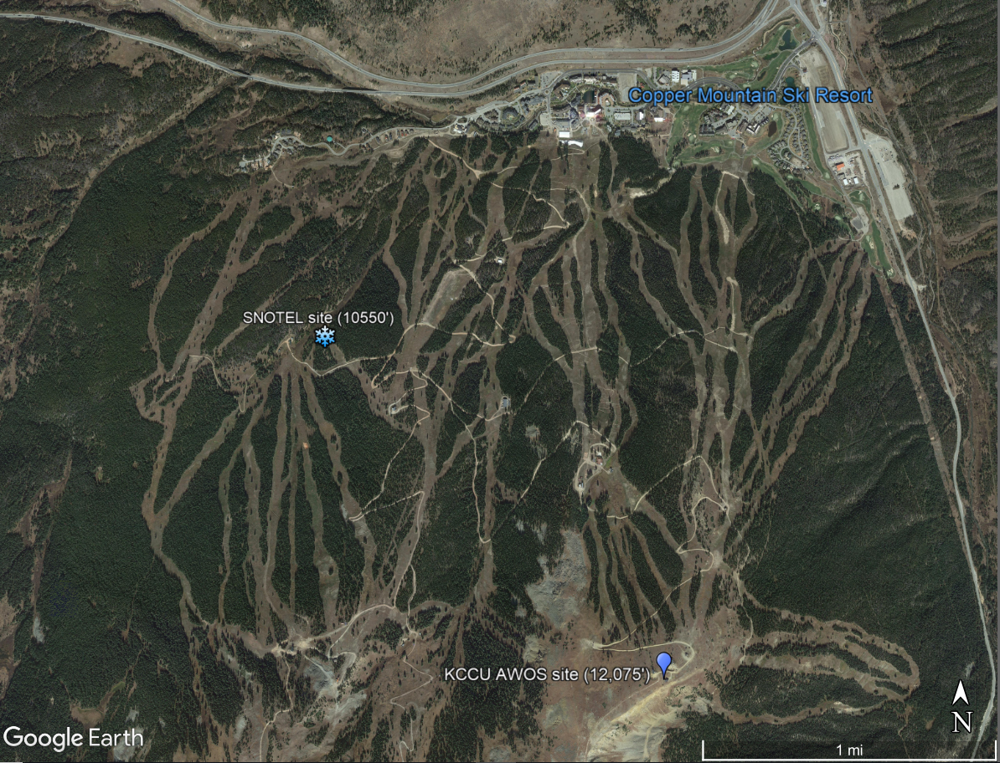
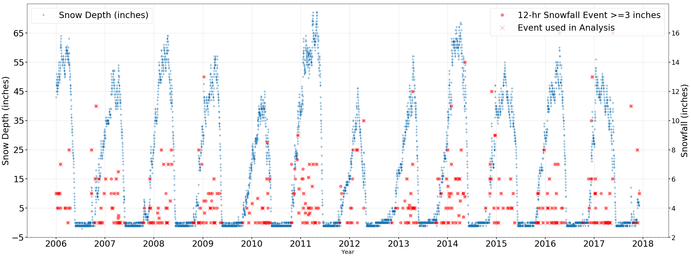
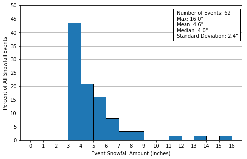

**By Dustin Rapp**  

--  
--  

## Introduction
***
Complex terrain in mountainous areas often make predicting snowfall difficult with prognostic weather models - especially on specific slopes or mountainsides where extremely localized air flows may complicate such forecasts.  With accurate snow forecasts, ski resorts can optimize their snowfall making, grooming, and snow removal operations. An accurate short term snowfall forecast, even for a small segment of the mountain may likely assist a ski resort's operation.  The goal of this study is to get a glimpse into the potential of utilizing a supervised learning techniques with freely available surface and meteorological data to predict snowfall on a slope at Copper Mountain Ski Resort in Colorado.  Copper Mountain Ski Resort may be especially interested in such predictive models because of the unique access to government funded meteorological data being recorded near or onsite to their resort.  

The purpose of this report is to discuss to describe an assessment of an Ordinary Least Squares Model (OLS) to predict snowfall totals over a 12 hour timespan, given meteorological conditions at the beginning of the 12 hour period.  Hourly meteorological data was obtained from nearby meteorological stations and upper air stations and was then processed into model-friendly inputs. A linear regression analysis was then performed on the data to determine which features may have most predictive power. Two OLS analyses were then performed - one which only utilized surface meteorological data and one which utilized surface and upper air data.  Finally, two similar assessmsents were performed using a decision tree regressor algorithm.  

## Data
The Copper Mountain ski resort is unique as there is an official SNOTEL National Resources Conservation Service monitoring station the north slope of Copper Mountain, where many popular ski runs are located. SNOTEL is a telemetry automated system of snowpack and related climate sensors in the Western United States. In addition to reporting hourly snowfall amounts, it also records temperature.  The Copper Mountain ski resort is also has an Colorado Department of Transportation Automated Weather Observing System (AWOS) which monitors a suite of hourly variables near the top of Copper Mountain.  Additionally, a National Weather Service Automated Surface Observing Station (ASOS) is located in Leadville, CO approximately 30 km to the northwest of Copper Mountain.  The SNOTEL si referencenced as SNOTEL, K

These three stations give a comprehensive meteorological dataset of surface variables in the vicinity of the Copper Mountain Resort.   **Table 1** gives a listing of all surface level meteorological variables by station. Hourly data for each station was downloaded for years 2005-2017 from online sources.  Data sources for each station are found in **Table 2**.  A map showing the Copper Mountain SNOTEL site and the meteorological sites used in this assessment is also shown in **Figure 1**  
  

 **Table 1 - Meteorological Variables by Station**  
 

|**Station ID/Num** |**Station Type**   |**Elevation**   |**Variables**     | **Data Source**   |  
|:-----------------:|:-----------------:|:----------------:|:--------------:|:-----------------:|
| **SNOTEL 415**    | SNOTEL    |10550'     | Surface Temperature   Surface Snow Depth       |   National Resources   Conservation Service   (www.NRCS.gov)
| **KLXV**          | ASOS      |12075      | Surface Wind Speed   Surface Wind Direction   Surface Pressure   Cloud Cover| National Climatic   Data Center   ISHD Lite format   (www.NCDC.gov) 
| **KCCU**          | AWOS      |10550'     | Surface Dewpoint   Surface Wind Direction   Surface Wind Speed   Surface Wind Direction   <Surface Pressure   Cloud Cover| National Climatic   Data Center   ISHD Lite format   (www.NCDC.gov) 
|**KJCT**           | RAOB      | n/a       | 200mb, 250mb, 300mb, 400mb, 500mb, 700mb, & 850mb Height    200mb, 250mb, 300mb, 400mb, 500mb, 700mb, & 850mb Temperature    200mb, 250mb, 300mb, 400mb, 500mb, 700mb, & 850mb Dewpoint     200mb, 250mb, 300mb, 400mb, 500mb, 700mb, & 850mb Wind Speed  
200mb, 250mb, 300mb, 400mb, 500mb, 700mb, & 850mb Wind Direction
  

***  

  ***
**Figure 1 - Map of SNOTEL and KCCU Station Locations at Copper Mountain Ski Report**  

 
KXLV site relative to Copper Mountain Ski Resort            |  Relative locations of the SNOTEL and KCCU sites at the Copper Mountain Ski Resort |
:---------------------------------------------------------- |:----------------------------------------------------------------------------------:|
                                          |                                                     

  

  

## Data and Wrangling Cleaning

### Data Organization
Hourly surface data from each station, downloaded, organized and combined into a single  timeseries dataframes with UTM timestamps.  

The following cleanup steps were performed on this dataset:

 - While the KCCU and KXLV datasets were already in UTM time, the NRCS dataset was in local time and required conversion to UTM.   
 -  The KCCU and KXLV datasets are in the Integrated Surface Hourly Data (ISHD) format and did require some manipulation (e.g. divided by 10) to get values into typical units. 
 - Missing values (e.g. 9999 values) were translated to NaN values.
 -  Missing data for all variables was linearly interpolated for time periods where 3 hours or less of data was missing. 

The data was plotted to see if there were any extreme values warranting removal. It was noted that some of the KCCU data (especially temperature) did not demonstrate as much of a diurnal variation as the KXLV station.  These data are considered suspicious but were not removed from the dataset.  A more robust quality control of this dataset is outside the scope of this preliminary study, but should be considered for future studies.

A small amount of anomalous data was observed in the SNOTEL snow depth data and was removed.  These physically unrealistic readings (e.g. spikes in some of the snow depth data or snowdepth reports which occur when temperatures did not support snowfall) were removed as well as extreme negative values. 

### Additional Calculations

**Pressure**  
Changes in pressure are often a predictive indicator of weather conditions (i.e. pressure drops often accompany strong storm systems), a twelve hour pressure change variable was added to the datset.  This was calculated by subtracting the 00:00 observation from the upcoming 12:00 observation.

**Snowfall**    
As the SNOTEL data only includes snow depth data instead of snowfall data, snowfall was calculated based on changes in snowdepth. Due to the sensitivity of the SNOTEL snow depth measurement sensors to external forces (e.g. debris, air pressure), snow depth data from the SNOTEL site appeared noisy for smaller snowstorms (i.e. less then 3 inches). To minimize the small scale perturbations found in the data, 12 hour snowfall totals were estimated at 00:00 UTC and 12:00 UTC and only 12-hr snowfall events where greater then or equal to 3 inches occurred were considered a snowfall event.  The snowfall data was then added to meteorological dataframe.   

Because only 00:00 and 12:00 snowfall observations were utilized in the analysis, all variables in the meteorological dataframe were reduced from hourly observations to twelve hour observations.  A new dataframe was created utilizing only 00:00 and 12:00 observations.

A table showing the total number of snowfall events, along with mean, max, and standard deviation of snowfall for each year is found in **Table 3**.  A timeseries plot showing the snowdepth, along with these snowfall events is found in **Figure 2**.
  

***

**Table 3  Annual Statistics of 12-hr Snowfall Events (>=3")**  

***

**Insert Figure 2  Timeseries of snow depth and snowfall events**  
 

  

  

  

## Data For Analysis  
  
| Year           |   # of Events with Met |   Poss # of Events |   Mean |   Median |   Max |   Std Deviation |
|----------------|------------------------|--------------------|--------|----------|-------|-----------------|
| 2006           |                     21 |                 26 |    5   |      5   |  11   |            2.05 |
| 2007           |                     23 |                 29 |    3.9 |      3.3 |   6.5 |            1.18 |
| 2008           |                     25 |                 27 |    4.3 |      3.3 |   8   |            1.84 |
| 2009           |                     16 |                 27 |    3.9 |      3.8 |   6   |            0.87 |
| 2010           |                     20 |                 30 |    4.4 |      3.8 |   9   |            1.77 |
| 2011           |                      0 |                 32 |  nan   |    nan   | nan   |          nan    |
| 2012           |                      5 |                 14 |    6.4 |      8   |  10   |            2.87 |
| 2013           |                     23 |                 32 |    4.4 |      4   |  12   |            1.94 |
| 2015           |                     21 |                 23 |    4.2 |      4   |   8   |            1.27 |
| 2016           |                      0 |                 32 |  nan   |    nan   | nan   |          nan    |
| 2017           |                     22 |                 29 |    4.9 |      3   |  16   |            3.14 |
| All            |                    213 |                338 |    4.7 |      4   |  16   |            2.16 |
| Training Set A |                    170 |                283 |    4.6 |      4   |  14   |            2.01 |
| Training Set B |                    176 |                301 |    4.4 |      4   |  16   |            1.99 |
| Test Set A     |                     43 |                 55 |    4.9 |      4   |  16   |            2.66 |
| Test Set B     |                     37 |                 37 |    5.7 |      5   |  14   |            2.57 |

***  

  
## Linear Regression Analysis  

To assess snowfall prediction potential with Ordinary Least Squares (OLS) model, a linear regression analysis was performed on each feature in the dataset.  For each potential variable, data was plotted against snowfall amounts which would occur over the next 12 hours.    Slope, standard error, R square values, along with p values were calculated for all variables. 

Results from the Linear Regression Analysis can be found **here**. The variables with the best predictive capabilities are dewpoint, KCCU Wind Speed, and pressure changes. Though Cloud Cover does have higher R values as well, the p values and amount of data missing is also very high. While the R values are not notably high (all are less then 0.2), p values for dewpoint, 12-hr pressure change are less then 0.05, indicating that there may be some predictive skill with an OLS model.  It is also important to note that that cloud cover is a categorical variable (values are in integers from 0 to 8) and wind direction is a circular variables (values range from 0 to 360 degrees) and do not lend themselves well to linear regression type statistic.  These two variables should be considered cautiously in a linear regression analysis, but will be considered  in an OLS analysis as some predictive properties may be 

There

***

##  OLS Model  

Utilizing the statsmodel api with the meteorological datasets, the OLS function was utilized to determine best fit parameters for a OLS model. To train the model, the data was partitioned such that approximately 80% of the data was used for training. The remaining 20% of the data was used for testing purpose.  Two different test/train partitions were made based on time and considering statistics found in **Table 1**:
**Partition A:** Data in years 2006 and 2017 were used as the testing set, while years (2007-2016) of the meteorological datasets were used as the training set
**Partition B:** Data in year 2014 was used as the testing set, while the remaining years (2006-2013, 2015-2017) were used as the training set

Two different analyses were performed on each of the two training partitions - one only utilizing surface meteorological variables, and the other utilizing both upper air and surface variables. A forward stepwise approach was used using the adjusted R squared value as the metric to determine the best combination of coefficient. To perform forward stepwise iterations, model was first fitted containing a single predictors. Predictors are then added to the model, one at the time. The adjusted R squared value is calculated at each step, and the variable that gave the greatest additional improvement to the fit is added to the model. At the end of the steps, the combination of predictors which gave the highest predictive value to the model will have been found.

The results of the analyses are found in **Table 1** and **Table 2**.  Note that while the adjusted R-squared is small, the F-statistics probability is significant (<0.02) for Surface Data only cases, and <0.005 for the Surface+Upper Air Data cases. This is important to note as it indicates that linear relationships developed in these modeled is likely not by chance, and there is potentially some predictive skill.

### Table 1 - OLS Model 1: Statistics Using  207Training Data A

|Dataset                   |  R-squared  |  Adj. R-squared: |   F-statistic:  |    Prob (F-statistic):  |   Combination of Best Fit Features in  OLS  |
|:---------------------------:|:-----------:|:----------------:|:---------------:|:-----------------------:|:--------------------------------------------------------------------------------------------:|
|Surface Data Only          |  0.060      | 0.044            |   3.765         |0.0118                   |  LXV 12hr delta Pressure,   CMtn Dewpoint,   CMtn WindSpeed |
| Surface+Upper Air Data   |  0.191      |   0.129         |     3.087     |0.000606            |   400mb-250mb Dewpoint,    CMtnSNTL Temperature,    CMtnSntl Temperature,     LXV 12hr delta Pressure,    400-200mb Dewpoint,    700mb Wind Direction,   500mb-300mb Wind Direction,    CMtn Dewpoint,    250mb Temperature,   250-200mb Dewpoint,   300-250mb Wind Direction,    400-200mb Temperature,    CMtn Wind Speed,   500-200mb height

 
  
 ***  
### Table 2 - OLS Model Statistics Using Partition B

|Dataset                   |  R-squared  |  Adj. R-squared: |   F-statistic:  |    Prob (F-statistic):  |   Combination of Best Fit Features in  OLS  |
|:---------------------------:|:-----------:|:----------------:|:---------------:|:-----------------------:|:--------------------------------------------------------------------------------------------:|
|Surface Data Only          |  0.083    | 0.063            |   4.166         | 0.00297                  |  LXV 12hr delta Pressure,   CMtn_WindDirection_deg,   CMtn_WindSpeed_mps   CMtn_Dewpoint_degC
| Surface+Upper Air Data   | 0.206    |   0.142      |      3.236     | 0.000229               |  700-250mb Wind Direction,    400-300mb Wind Direction,    LXV Temperature,    LXV Wind Speed,    400mb Wind Direction,    300-200mb Dewpoint,    CMtnSNTL Temperature,     700-400mb Temperature,     250-200mb Dewpoint,    700mb Wind Speed,    500mb Wind Direction,    250-200mb Temperature,    500-200mb Height,    300-250mb Wind Direction,    CMtn Wind Direction,    250-200mb Wind Speed,    250mb Wind Direction,    400mb Dewpoint,    700-500mb Wind Direction,    CMtn Dewpoint
                                                                                                                                                                                                                                                                                                                                                                                                                                                                                                                                            

***  

The Partition A and Partition B test data was then given to the respectively trained OLS models.  **Figure 3** shows predicted vs actual snowfall amounts for these model runs. Notice that model trained with Partition A did a much better job of predicting actual snowfall amounts then the model trained with Partition B data. The linear regression performed on Partition A model output shows very small p values and R values of 0.297 when using Surface Data only, and 0.37 when using both Surface and Upper Air Data. However, the Partition B model performed very poorly - p values were extremely high, indicating that the the linear fit is likely not significant. It was noted that over 50% of snowfalls in the Partition A test set was 3".  There were a much higher number of larger snowfall events in the 2014 dataset.

| ID       | Description                    |   R2 Score |   RMSE |   MAE |   MAPE |    MPE |
|----------|-------------------------------|------------|--------|-------|--------|--------|
| A0-SFC   | Partition A Test Data (Surface Data Features only)          |      0.046 |  2.6   | 1.588 |  0.298 | -0.065 |
| A0-UASFC | Partition A Test Data (Surface+Upper Air Data Features)        |      0.128 |  2.487 | 1.655 |  0.335 | -0.113 |
| B0-SFC   | Partition B Test Data (Surface Data Features only)            |     -0.174 |  2.785 | 1.879 |  0.294 |  0.062 |
| B0-UASFC | Partition B Test Data (Surface+Upper Air Data Features)        |     -0.412 |  3.055 | 2.281 |  0.384 |  0.082 |
 
  
  

 From **Figure 3a** and **Figure 3b**, it can be seen the performance of the model using Partition A features does show the model does generate a fit line which is positively sloped with a value of 0.053 with just surface features and 0.019 when upper air data features are included.  This indicates the fit is likely due to skill rather then chance, especially when upper air data is included.  The RMSE using surface data alone was 2.6.  When upper air data is included, the RMSE reduces to 2.501, indicating some improvement to the model whenever upper air data is included.

**Figure 3c** and **Figure 3d** shows a linear regression fit for predicted vs actual snow using model predicted values generated with a model utilizing Partition B features.  The fit is much poorer then the Partition A case.  The p values are very large (0.478 and 0.462 for the surface data and surface+upper air data features, respectively).  This indicates a very poor fit.  

Interestingly, a comparision of statistics in Table 1 and Table 2 would suggest that the Partition B features might perform better then the Partition A data.  This would indicate that there may be something odd about the 2014 data used to test the OLS model.  A histogram of snow fall events for each of the snowfall events used in the test/train sets were then generated.  These are shown in **Figure 7**.  Notice that the Partition B Test set has a noticiably different distribution then the other test/training sets.  It has a noticibly smaller number of 3-4" snowfalls then the other test/training sets.  In addition, it has a higher percentage of snowfall events greater then 7" then the Partition B Training Set (**Figure 3c**). The large differences in snowfall could be part of the reason for the extremely poor performance.

A quantile-quantile plot for each model run is also shown in **Figure 4**.  Ideally, the sample quantiles should fall on the red line.  This would indicate that the distrbution of the residuals is normal and that the errors experienced by the model are random.  The QQ plots show that many of the points skew off the red line in the upper quantiles, indicating that there is some bias in the model.  In addition, plots of predicted vs residual (actual minus predicted) data is shown in FIgure 75  In general, the points are random except that there seems to be a downward sloping tilt.  It is apparanet that the model increasingly underpredicts at increasingly higher snowfall ammounts.  Tying this back to Figure 4, the model rarely underpredicts the 3" snowfall values (the lowest snowfall events in the model).  This is reason for the cutoff in these plots. in Figure 11.  In addition, Figure 3 shows that the model rarely predicts snowfall values greater then 6".  This could be due to the training sets being heavily biased with lower snowfall amounts (see Figure X).

### Figure 7 - Histogram of Test/Train Sets

**(a) Partition A OLS Training Set**                        | **(b)  Partition A Test Set**  
:---------------------------------------------------------- |:----------------------------------------------------------------------------------:|
               |   
  
**(c) Partition B Training Set**                                | **(d)  Partition B Test Set:**
:---------------------------------------------------------- |:----------------------------------------------------------------------------------:|
               |   
  

# Cross Validation Using Best Features of Training/Test Data Partition A -------------------------------------------------------------------------------------------------------------
  
Due to the discrepancy in performance between the two test/train partition datasets, and additional analysis was performed which applied cross validation to the snowfall data. Utilizing SKLearn's KFold function, 5 partition folds were developed based on the 213 available snowfall events. The snowfall data events were randomized as well. Breaking the data into 5 folds resulted in an approximated 80% training/20% splits.  Utilizing the sklearn crossval function, cross validation was performed on these partitions, resulting in a predicted value for every snowfall event. Each snowfall event was predicted based on a trained model which did not utilize the predicted snowfall events actual data.   The results of these analyses are found in **Figure 7** through **Figure 10**.
### Figure 8 - Cross Validation Predicted vs Actual Snowfall Amounts

**(a) Partition A OLS Model Feature Set:  Surface Data Only**   | **(b)  Partition A OLS Model Feature Set:  Surface Data + Upper Air Data**                                           | 
:----------------------------------------------------------:|:----------------------------------------------------------------------------------:|
                    |    
  
**(c) Partition B OLS Model Feature Set:  Surface Data Only**   | **(d)  Partition B OLS Model Feature Set:  Surface Data + Upper Air Data** 
:---------------------------------------------------------- |:----------------------------------------------------------------------------------:|
               |   
***  
***  
### Figure 9 -  Cross Validation QQ Plot of Residuals  

**(a) Partition A OLS Model Feature Set:  Surface Data Only**   | **(b)  Partition A OLS Model Feature Set:  Surface Data + Upper Air Data**  
:---------------------------------------------------------- |:----------------------------------------------------------------------------------:|
                         |    
  
**(c) Partition B OLS Model Feature Set:  Surface Data Only**   | **(d)  Partition B OLS Model Feature Set:  Surface Data + Upper Air Data** 
:---------------------------------------------------------- |:----------------------------------------------------------------------------------:|
                         |    
   
***  
***  
### Figure 11 -  Cross Validation Residuals vs Predicted Snowfall  

**(a) Partition A OLS Model Feature Set:  Surface Data Only**   | **(b)  Partition A OLS Model Feature Set:  Surface Data + Upper Air Data**  
:---------------------------------------------------------- |:----------------------------------------------------------------------------------:|
  |    
  
**(c) Partition B OLS Model Feature Set:  Surface Data Only**   | **(d)  Partition B OLS Model Feature Set:  Surface Data + Upper Air Data** 
:---------------------------------------------------------- |:----------------------------------------------------------------------------------:|
  |    
  
***  
***  
### Figure 12 -  Cross Validation Histogram of Residuals  

**(a) Partition A OLS Model Feature Set:  Surface Data Only**   | **(b)  Partition A OLS Model Feature Set:  Surface Data + Upper Air Data**  
:---------------------------------------------------------- |:----------------------------------------------------------------------------------:|
  |    
  
**(c) Partition B OLS Model Feature Set:  Surface Data Only**   | **(d)  Partition B OLS Model Feature Set:  Surface Data + Upper Air Data** 
:---------------------------------------------------------- |:----------------------------------------------------------------------------------:|
  |   
  

  

### Figure 13 Summary of OLS Model Statistics

**(a) Scikit-learn R2 Score Summary**                        | **RMSE Summary**        |                                              
:----------------------------------------------------------:|:------------------------------------:|  
                              |   | 
