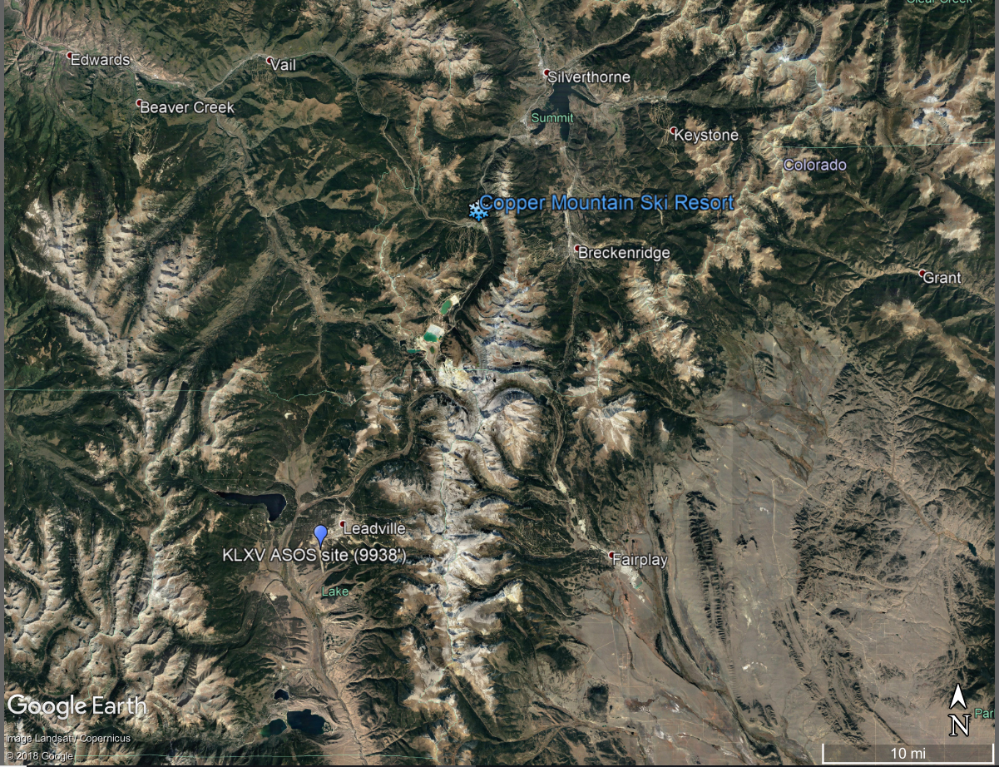

## Capstone:  
# Utilizing Meteorological Data with Supervised Learning to Predict Snowfall Amounts at Ski Resort
**By Dustin Rapp**  

--  
--  

## Introduction
***
Complex terrain in mountainous areas often make predicting snowfall difficult with prognostic weather models - especially on specific slopes or mountainsides where extremely localized air flows may complicate such forecasts.  With accurate snow forecasts, ski resorts can optimize their snowfall making, grooming, and snow removal operations. An accurate short term snowfall forecast, even for a small segment of the mountain may likely assist a ski resort's operation.  The goal of this study is to get a glimpse into the potential of utilizing a supervised learning techniques with freely available surface and meteorological data to predict snowfall on a slope at Copper Mountain Ski Resort in Colorado.  Copper Mountain Ski Resort may be especially interested in such predictive models because of the unique access to government funded meteorological data being recorded near or onsite to their resort.  

The purpose of this report is to discuss to describe an assessment of an Ordinary Least Squares Model (OLS) to predict snowfall totals over a 12 hour timespan, given meteorological conditions at the beginning of the 12 hour period.  Hourly meteorological data was obtained from nearby meteorological stations and upper air stations and was then processed into model-friendly inputs. A linear regression analysis was then performed on the data to determine which features may have most predictive power. Two OLS analyses were then performed - one which only utilized surface meteorological data and one which utilized surface and upper air data.  Finally, two similar assessmsents were performed using a decision tree regressor algorithm.  

## Data
The Copper Mountain ski resort is unique as there is an official SNOTEL National Resources Conservation Service monitoring station the north slope of Copper Mountain, where many popular ski runs are located. SNOTEL is a telemetry automated system of snowpack and related climate sensors in the Western United States. In addition to reporting hourly snowfall amounts, it also records temperature.  The Copper Mountain ski resort is also has an Colorado Department of Transportation Automated Weather Observing System (AWOS) which monitors a suite of hourly variables near the top of Copper Mountain.  Additionally, a National Weather Service Automated Surface Observing Station (ASOS) is located in Leadville, CO approximately 30 km to the northwest of Copper Mountain.  The SNOTEL si referencenced as SNOTEL, K

These three stations give a comprehensive meteorological dataset of surface variables in the vicinity of the Copper Mountain Resort.   **Table 1** gives a listing of all surface level meteorological variables by station. Hourly data for each station was downloaded for years 2005-2017 from online sources.  Data sources for each station are found in **Table 2**.  A map showing the Copper Mountain SNOTEL site and the meteorological sites used in this assessment is also shown in **Figure 1**  
  

 **Table 1 - Meteorological Variables by Station**  
 

|**Station ID/Num** |**Station Type**   |**Elevation**   |**Variables**     | **Data Source**   |  
|:-----------------:|:-----------------:|:----------------:|:--------------:|:-----------------:|
| **SNOTEL 415**    | SNOTEL    |10550'     | Temperature   Snow Depth       |   National Resources   Conservation Service   (www.NRCS.gov)
| **KLXV**          | ASOS      |12075      | Wind Speed   Wind Direction   Cloud Cover| National Climatic   Data Center   ISHD Lite format   (www.NCDC.gov) 
| **KCCU**          | AWOS      |10550'     | Dewpoint   W  Wind Speed   Wind Direction   Cloud Cover| National Climatic   Data Center   ISHD Lite format   (www.NCDC.gov) 
|**KJCT**           | RAOB      | n/a       |
  

***  

  ***
**Figure 1 - Map of SNOTEL and KCCU Station Locations at Copper Mountain Ski Report**  

 
KXLV site relative to Copper Mountain Ski Resort            |  Relative locations of the SNOTEL and KCCU sites at the Copper Mountain Ski Resort |
:---------------------------------------------------------- |:----------------------------------------------------------------------------------:|
                                          |                                                     

  

  

## Data and Wrangling Cleaning

### Data Organization
Hourly surface data from each station, downloaded, organized and combined into a single  timeseries dataframes with UTM timestamps.  

The following cleanup steps were performed on this dataset:

 - While the KCCU and KXLV datasets were already in UTM time, the NRCS dataset was in local time and required conversion to UTM.   
 -  The KCCU and KXLV datasets are in the Integrated Surface Hourly Data (ISHD) format and did require some manipulation (e.g. divided by 10) to get values into typical units. 
 - Missing values (e.g. 9999 values) were translated to NaN values.
 -  Missing data for all variables was linearly interpolated for time periods where 3 hours or less of data was missing. 

The data was plotted to see if there were any extreme values warranting removal. It was noted that some of the KCCU data (especially temperature) did not demonstrate as much of a diurnal variation as the KXLV station.  These data are considered suspicious but were not removed from the dataset.  A more robust quality control of this dataset is outside the scope of this preliminary study, but should be considered for future studies.

A small amount of anomalous data was observed in the SNOTEL snow depth data and was removed.  These physically unrealistic readings (e.g. spikes in some of the snow depth data or snowdepth reports which occur when temperatures did not support snowfall) were removed as well as extreme negative values. 

### Additional Calculations

**Pressure**  
Changes in pressure are often a predictive indicator of weather conditions (i.e. pressure drops often accompany strong storm systems), a twelve hour pressure change variable was added to the datset.  This was calculated by subtracting the 00:00 observation from the upcoming 12:00 observation.

**Snowfall**    
As the SNOTEL data only includes snow depth data instead of snowfall data, snowfall was calculated based on changes in snowdepth. Due to the sensitivity of the SNOTEL snow depth measurement sensors to external forces (e.g. debris, air pressure), snow depth data from the SNOTEL site appeared noisy for smaller snowstorms (i.e. less then 3 inches). To minimize the small scale perturbations found in the data, 12 hour snowfall totals were estimated at 00:00 UTC and 12:00 UTC and only 12-hr snowfall events where greater then or equal to 3 inches occurred were considered a snowfall event.  The snowfall data was then added to meteorological dataframe.   

Because only 00:00 and 12:00 snowfall observations were utilized in the analysis, all variables in the meteorological dataframe were reduced from hourly observations to twelve hour observations.  A new dataframe was created utilizing only 00:00 and 12:00 observations.

A table showing the total number of snowfall events, along with mean, max, and standard deviation of snowfall for each year is found in **Table 3**.  A timeseries plot showing the snowdepth, along with these snowfall events is found in **Figure 2**.
  

***

**Table 3  Annual Statistics of 12-hr Snowfall Events (>=3")**  

***

**Insert Figure 2  Timeseries of snow depth and snowfall events**  
 

  

  

  

## Data For Analysis  
  
| Year   |   Number 12hr Snowfall Events >=3"   with no missing meteorological features missing for hour     |   Poss |   Mean |   Median |   Max |   Std Deviation |
|--------|---------------------------------------------|--------|--------|----------|-------|-----------------|
| 2006   |                                21           |     26 |    5   |      5   |  11   |            2.05 |
| 2007   |                                23           |     29 |    3.9 |      3.3 |   6.5 |            1.18 |
| 2008   |                                25           |     27 |    4.3 |      3.3 |   8   |            1.84 |
| 2009   |                                16           |     27 |    3.9 |      3.8 |   6   |            0.87 |
| 2010   |                                20           |     30 |    4.4 |      3.8 |   9   |            1.77 |
| 2011   |                                 0           |     32 |    -   |       -  |   -   |          -      |
| 2012   |                                 5           |     14 |    6.4 |      8   |  10   |            2.87 |
| 2013   |                                23           |     32 |    4.4 |      4   |  12   |            1.94 |
| 2014   |                                37           |     37 |    5.7 |      5   |  14   |            2.57 |
| 2015   |                                21           |     23 |    4.2 |      4   |   8   |            1.27 |
| 2016   |                                 0           |     32 |    -   |       -  |   -   |          -      |
| 2017   |                                22           |     29 |    4.9 |      3   |  16   |            3.14 |
| All    |                               213           |    338 |  4.7   |      4   |  16   |            2.16 |
| Test   |                                37           |     37 |    5.7 |      5   |  14   |            2.57 |
| Train  |                               213           |    301 |    4.7 |      4   |  16   |            2.16 |

  
## Linear Regression Analysis  

To assess snowfall prediction potential with Ordinary Least Squares (OLS) model, a linear regression analysis was performed on each feature in the dataset.  For each potential variable, data was plotted against snowfall amounts which would occur over the next 12 hours.    Slope, standard error, R square values, along with p values were calculated for all variables. 

A table showing results from this analysis are shown in **Table 3**.  The data are sorted by largest R value. Note that the variables with the best predictive capabilities are dewpoint, KCCU Wind Speed, and pressure changes. Though Cloud Cover does have higher R values as well, the p values and amount of data missing is also very high. While the R values are not notably high (all are less then 0.2), p values for dewpoint, 12-hr pressure change are less then 0.05, indicating that there may be some predictive skill with an OLS model.  It is also important to note that that cloud cover is a categorical variable (values are in integers from 0 to 8) and wind direction is a circular variables (values range from 0 to 360 degrees) and do not lend themselves well to linear regression type statistic.  These two variables should be considered cautiously in a linear regression analysis, but will be considered  in an OLS analysis as some predictive properties may be 

There

***

**Table 3 - Output statistics from Linear Regression Analysis [1]**  
  
 | Feature                                         |      Max |      Min |     Mean |   Slope |   Std Error |   R Value |   P-value |   % Missing |      Abs R |   SNF Counts |   Feature Counts |
|-------------------------------------------------|----------|----------|----------|---------|-------------|-----------|-----------|-------------|------------|--------------|------------------|
| CMtn_ CMtn_Dewpoint_degC                        |      0.0 |    -27.0 |     -9.7 |   0.081 |       0.029 |     0.181 |     0.006 |        25.0 | 0.180794   |          301 |              227 |
| LXV LXV_Dewpoint_degC                           |      2.8 |    -22.8 |     -8.0 |   0.083 |       0.032 |     0.159 |     0.009 |        11.0 | 0.158541   |          301 |              269 |
| CMtn_ CMtn_CloudCover_oktas                     |      8.0 |      0.0 |      7.4 |   0.145 |       0.085 |     0.142 |     0.089 |        52.0 | 0.141753   |          301 |              145 |
| LXV LXV_CloudCover_oktas                        |      8.0 |      0.0 |      6.8 |   0.088 |       0.059 |     0.122 |     0.136 |        50.0 | 0.121625   |          301 |              152 |
| LXV LXV_Temperature_degC                        |     13.3 |    -17.2 |     -2.9 |   0.043 |       0.026 |     0.101 |     0.100 |        11.0 | 0.100527   |          301 |              269 |
| LXV LXV_WindDirection_deg                       |    360.0 |      0.0 |    179.7 |  -0.002 |       0.001 |    -0.098 |     0.107 |        11.0 | 0.098491   |          301 |              269 |
| LXV LXV_12hr_delta_Pressure_hp                  |     13.3 |    -20.2 |     -3.0 |  -0.039 |       0.024 |    -0.098 |     0.112 |        12.0 | 0.0975685  |          301 |              266 |
| CMtnSNTL_ CMtnSNTL_Temp_degC                    |      7.6 |    -18.7 |     -3.5 |   0.050 |       0.030 |     0.096 |     0.098 |         0.0 | 0.0955384  |          301 |              301 |
| CMtn_ CMtn_Temperature_degC                     |      7.0 |    -21.0 |     -4.7 |   0.043 |       0.031 |     0.092 |     0.167 |        25.0 | 0.0919552  |          301 |              227 |
| CMtn_ CMtn_WindDirection_deg                    |    360.0 |      0.0 |    236.0 |   0.002 |       0.002 |     0.072 |     0.286 |        27.0 | 0.0724723  |          301 |              219 |
| CMtn_ CMtn_WindSpeed_mps                        |     16.9 |      0.0 |      7.4 |   0.036 |       0.036 |     0.067 |     0.322 |        27.0 | 0.0671684  |          301 |              219 |
| LXV LXV_6hr_Precipitation_mm                    |     10.2 |     -0.1 |      0.9 |   0.088 |       0.089 |     0.063 |     0.325 |        19.0 | 0.0633812  |          301 |              243 |
| LXV LXV_WindSpeed_mps                           |     11.8 |      0.0 |      3.6 |  -0.047 |       0.057 |    -0.051 |     0.403 |        11.0 | 0.051206   |          301 |              269 |
| LXV LXV_Pressure_hp                             |   1028.5 |    983.3 |   1005.3 |  -0.013 |       0.016 |    -0.050 |     0.420 |        11.0 | 0.0495101  |          301 |              267 |

[1] Feature statistics are calculated based on only 12-hr values which  have a matching 12-hr snowfall value
  
 

| Feature                                         |      Max |      Min |     Mean |   Slope |   Std Error |   R Value |   P-value |   % Missing |      Abs R |   SNF Counts |   Feature Counts |
|-------------------------------------------------|----------|----------|----------|---------|-------------|-----------|-----------|-------------|------------|--------------|------------------|
| CMtn_ CMtn_Dewpoint_degC                        |      0.0 |    -27.0 |     -9.7 |   0.081 |       0.029 |     0.181 |     0.006 |        25.0 | 0.180794   |          301 |              227 |
| speed_kts KGJT_250mb_speed_kts                  |    163.0 |      8.0 |     76.4 |   0.011 |       0.004 |     0.172 |     0.003 |         2.0 | 0.17217    |          301 |              295 |
| speed_kts KGJT_300mb_speed_kts                  |    151.0 |      7.0 |     71.8 |   0.012 |       0.004 |     0.167 |     0.004 |         2.0 | 0.167416   |          301 |              296 |
| speed_kts KGJT_400mb_speed_kts                  |    116.0 |      4.0 |     54.0 |   0.015 |       0.005 |     0.167 |     0.004 |         1.0 | 0.167206   |          301 |              299 |
| height_m KGJT_d500_400_height_m                 |  -1550.0 |  -1680.0 |  -1613.1 |  -0.014 |       0.005 |    -0.166 |     0.004 |         1.0 | 0.166312   |          301 |              299 |
| tmpc KGJT_400mb_tmpc                            |    -22.7 |    -42.5 |    -32.3 |   0.087 |       0.031 |     0.162 |     0.005 |         1.0 | 0.161833   |          301 |              299 |
| LXV LXV_Dewpoint_degC                           |      2.8 |    -22.8 |     -8.0 |   0.083 |       0.032 |     0.159 |     0.009 |        11.0 | 0.158541   |          301 |              269 |
| speed_kts KGJT_500mb_speed_kts                  |     96.0 |      2.0 |     41.4 |   0.018 |       0.007 |     0.153 |     0.008 |         1.0 | 0.153061   |          301 |              299 |
| height_m KGJT_d500_300_height_m                 |  -3470.0 |  -3710.0 |  -3580.0 |  -0.006 |       0.002 |    -0.153 |     0.008 |         1.0 | 0.152943   |          301 |              299 |
| speed_kts KGJT_d700_250_speed_kts               |     12.0 |   -132.0 |    -55.3 |  -0.011 |       0.004 |    -0.152 |     0.009 |         2.0 | 0.152038   |          301 |              295 |
| drct KGJT_d700_500_drct                         |    345.0 |   -355.0 |     -8.4 |   0.004 |       0.002 |     0.151 |     0.009 |         1.0 | 0.150643   |          301 |              299 |
| tmpc KGJT_500mb_tmpc                            |     -9.9 |    -30.5 |    -20.4 |   0.084 |       0.033 |     0.145 |     0.012 |         1.0 | 0.145121   |          301 |              299 |
| height_m KGJT_d700_300_height_m                 |  -5979.0 |  -6391.0 |  -6156.1 |  -0.004 |       0.001 |    -0.145 |     0.012 |         1.0 | 0.144929   |          301 |              299 |
| speed_kts KGJT_d700_300_speed_kts               |     23.0 |   -131.0 |    -50.7 |  -0.011 |       0.004 |    -0.144 |     0.013 |         2.0 | 0.143623   |          301 |              296 |
| height_m KGJT_d500_250_height_m                 |  -4620.0 |  -4970.0 |  -4772.4 |  -0.005 |       0.002 |    -0.142 |     0.014 |         1.0 | 0.142035   |          301 |              299 |
| height_m KGJT_d700_400_height_m                 |  -4055.0 |  -4361.0 |  -4189.3 |  -0.005 |       0.002 |    -0.142 |     0.014 |         1.0 | 0.141794   |          301 |              299 |
| speed_kts KGJT_200mb_speed_kts                  |    157.0 |      5.0 |     69.9 |   0.010 |       0.004 |     0.142 |     0.015 |         3.0 | 0.141705   |          301 |              292 |
| height_m KGJT_d700_250_height_m                 |  -7139.0 |  -7611.0 |  -7348.5 |  -0.003 |       0.001 |    -0.141 |     0.015 |         1.0 | 0.141036   |          301 |              299 |
| drct KGJT_700mb_drct                            |    355.0 |      0.0 |    247.4 |   0.005 |       0.002 |     0.139 |     0.016 |         1.0 | 0.138809   |          301 |              299 |
| tmpc KGJT_d700_400_tmpc                         |     38.9 |     16.8 |     29.3 |  -0.072 |       0.030 |    -0.138 |     0.017 |         1.0 | 0.138276   |          301 |              299 |
| drct KGJT_d500_250_drct                         |    350.0 |    -85.0 |     -0.1 |  -0.006 |       0.003 |    -0.133 |     0.023 |         2.0 | 0.13254    |          301 |              295 | 
  
  

##  OLS Model  

tilizing the statsmodel api with the meteorological datasets, the OLS function was utilized to determine best fit parameters for a OLS model. To train the model, the last 10 years (2008-2017) of the meteorological datasets were used. The first two years of meteorological data (2006-2007) was used as the test test set. Two different analyses were performed - one only utilizing surface meteorological variables, and the other utilizing both upper air and surface variables. A forward stepwise approach was used using the adjusted R squared value as the metric to determine the best combination of coefficient. To perform forward stepwise iternations, model was first fitted containing a single predictors. Predictors are then added to the model, one at the time. The adjusted R squared value is calcuated at each step, and the variable that gave the greatest additional improvement to the fit is added to the model. At the end of the steps, the combination of predictors which gave the highest predictive value to the model will have been found.

It was observed that instability in the model arose whenver variables with low data capture wer
### Surface Data Only  

### Surface + Upper Air Data  

## Decision Tree Regressor Model  

## Conclusion  

While not large, there are some significant relationships between some meteorological variables and snowfall amount when snowfall does occur.  It is anticipated that there may be some 12-hr snowfall predictive ability predicting snowfall utilizing a very simple Ordinary Least Squares model with only meteorological measurements - especially dewpoint and 12-hr pressure changes. There is recognition that snowfall is a very complex variable to forecast, and a simple OLS model may have limitations. Snowfall amounts can dependent on a variety of factors including snow water equivalent, temperature during crystal formation in the upper atmosphere, along with melting/freezing activity as snowflakes fall to the surface.  Upper air data may be helpful in overcoming some of these complexities and limitations, and my be integrated in this analysis.  Despite the complexities of a snowfall prediction, an OLS model is a good starting point to begin to understand how data science techniques could be utilized. 

  
  

# OLS Model Training/Test Data Partition 1 -------------------------------------------------------------------------------------------------------------

|OLS Model                    |  R-squared  |  Adj. R-squared: |   F-statistic:  |    Prob (F-statistic):  |  Log-Likelihood:  |  AIC:  | BIC:   | Combination of Best Fit Features in  OLS  |
|:---------------------------:|:-----------:|:----------------:|:---------------:|:-----------------------:|:-----------------:|:------:|:------:|:--------------------------------------------------------------------------------------------:|
|Surface Data Only  P1        |  0.060      | 0.044            |   3.765         |0.0118                   |  -371.85          | 751.7  |  1019  |  LXV_12hr_delta_Pressure_hp, CMtn_Dewpoint_degC, CMtn_WindSpeed_mps |
| Surface+Upper Air Data P1   | 0.191       |   0.129          |      3.087      |0.000606                 |  -341.66          | 709.3   | 750.1  | KGJT_d400_250_dwpc, CMtnSNTL_Temp_degC, LXV_12hr_delta_Pressure_hp, KGJT_d400_200_dwpc,   KGJT_700mb_drct, KGJT_d500_300_drct, CMtn_Dewpoint_degC, KGJT_250mb_tmpc,   KGJT_d250_200_dwpc, KGJT_d300_250_drct, KGJT_d400_200_tmpc, CMtn_WindSpeed_mps, KGJT_d500_400_height_m  |

***  
***  

Surface Data Only                                           |  Surface Data + Upper Air Data                                                     |
:---------------------------------------------------------- |:----------------------------------------------------------------------------------:|
                               |    
  
  
***  
Surface Data Only                                           |  Surface Data + Upper Air Data                                                     |
:---------------------------------------------------------- |:----------------------------------------------------------------------------------:|
                                  |    
  

***  
Surface Data Only                                           |  Surface Data + Upper Air Data                                                     |
:---------------------------------------------------------- |:----------------------------------------------------------------------------------:|
                             |  

***  
Surface Data Only                                           |  Surface Data + Upper Air Data                                                     |
:---------------------------------------------------------- |:----------------------------------------------------------------------------------:|
                 | 
 

# Decision Tree ------------------------------------------------------------------------------------

Surface Data Only                                           |  Surface Data + Upper Air Data                                                     |
:---------------------------------------------------------- |:----------------------------------------------------------------------------------:|
                    |    

*** 

Surface Data Only                                           |  Surface Data + Upper Air Data                                                     |
:---------------------------------------------------------- |:----------------------------------------------------------------------------------:|
                               |    

***  

Surface Data Only                                           |  Surface Data + Upper Air Data                                                     |
:---------------------------------------------------------- |:----------------------------------------------------------------------------------:|
                               |    

***  
***  
  
  
  
# OLS Model Training/Test Data Partition 2 -------------------------------------------------------------------------------------------------------------
  
*** 
 
 

|OLS Model                    |  R-squared  |  Adj. R-squared: |   F-statistic:  |    Prob (F-statistic):  |  Log-Likelihood:  |  AIC:  | BIC:   | Combination of Best Fit Features in  OLS  |
|:---------------------------:|:-----------:|:----------------:|:---------------:|:-----------------------:|:-----------------:|:------:|:------:|:--------------------------------------------------------------------------------------------:|
|Surface Data Only  P2        |   0.083      | 0.063           |   4.166         |0.00297                   |  -386.87         | 783.7  |  800.0  | LXV_12hr_delta_Pressure_hp , CMtn_WindDirection_deg, CMtn_WindSpeed_mps, CMtn_Dewpoint_degC  |
| Surface+Upper Air Data P2   | 0.294      |    0.213         |      3.625      |5.68e-06                 |  -340.62         | 719.2   | 779.5 | KGJT_d700_250_drct, KGJT_d400_300_drct, LXV_Temperature_degC, LXV_WindSpeed_mps,   KGJT_400mb_drct, KGJT_d300_200_dwpc, CMtnSNTL_Temp_degC, KGJT_d700_400_tmpc,   KGJT_d250_200_dwpc, KGJT_700mb_speed_kts, KGJT_500mb_drct, KGJT_d250_200_tmpc,   KGJT_d500_200_height_m,  KGJT_d300_250_drct, CMtn_WindDirection_deg, KGJT_d250_200_speed_kts,   KGJT_250mb_drct, KGJT_400mb_dwpc, KGJT_d700_500_drct, CMtn_Dewpoint_degC  |

***  
  
  
** Figure 1  **

Surface Data Only                                           |  Surface Data + Upper Air Data                                                     |
:----------------------------------------------------------:|:----------------------------------------------------------------------------------:|
                               |    
  
  
***  
Surface Data Only                                           |  Surface Data + Upper Air Data                                                     |
:----------------------------------------------------------:|:----------------------------------------------------------------------------------:|
                                  |    
  

***  
Surface Data Only                                           |  Surface Data + Upper Air Data                                                     |
:----------------------------------------------------------:|:----------------------------------------------------------------------------------:|
                             |  

***  
Surface Data Only                                           |  Surface Data + Upper Air Data                                                     |
:----------------------------------------------------------:|:----------------------------------------------------------------------------------:|
                 |   
  

# Cross Validation Using Best Features of Training/Test Data Partition 1 -------------------------------------------------------------------------------------------------------------

Surface Data Only                                           |  Surface Data + Upper Air Data                                                     |
:----------------------------------------------------------:|:----------------------------------------------------------------------------------:|
                      |    
  
  
***  
Surface Data Only                                           |  Surface Data + Upper Air Data                                                     |
:---------------------------------------------------------- |:----------------------------------------------------------------------------------:|
                         |    
  

***  
Surface Data Only                                           |  Surface Data + Upper Air Data                                                     |
:---------------------------------------------------------- |:----------------------------------------------------------------------------------:|
                        |  

***  
Surface Data Only                                           |  Surface Data + Upper Air Data                                                     |
:---------------------------------------------------------- |:----------------------------------------------------------------------------------:|
               |   
  

# Cross Validation Using Best Features of Training/Test Data Partition 2 -------------------------------------------------------------------------------------------------------------

Surface Data Only                                           |  Surface Data + Upper Air Data                                                     |
:---------------------------------------------------------- |:----------------------------------------------------------------------------------:|
                      |    
  
  
***  
Surface Data Only                                           |  Surface Data + Upper Air Data                                                     |
:---------------------------------------------------------- |:----------------------------------------------------------------------------------:|
                         |    
  

***  
Surface Data Only                                           |  Surface Data + Upper Air Data                                                     |
:---------------------------------------------------------- |:----------------------------------------------------------------------------------:|
                        |  

***  
Surface Data Only                                           |  Surface Data + Upper Air Data                                                     |
:---------------------------------------------------------- |:----------------------------------------------------------------------------------:|
               |   
  

# Decision Tree ------------------------------------------------------------------------------------

Surface Data Only                                           | Surface Data + Upper Air Data                                                     |
:---------------------------------------------------------- |:----------------------------------------------------------------------------------:|
                    |    

*** 

Surface Data Only                                           |  Surface Data + Upper Air Data                                                     |
:---------------------------------------------------------- |:----------------------------------------------------------------------------------:|
                          |    

***  

Surface Data Only                                           |  Surface Data + Upper Air Data                                                     |
:---------------------------------------------------------- |:----------------------------------------------------------------------------------:|
                         |    

**Surface Data Only Decision Tree**  

  

***  
  
**Surface + Upper Air Data Decision Tree**  

  

