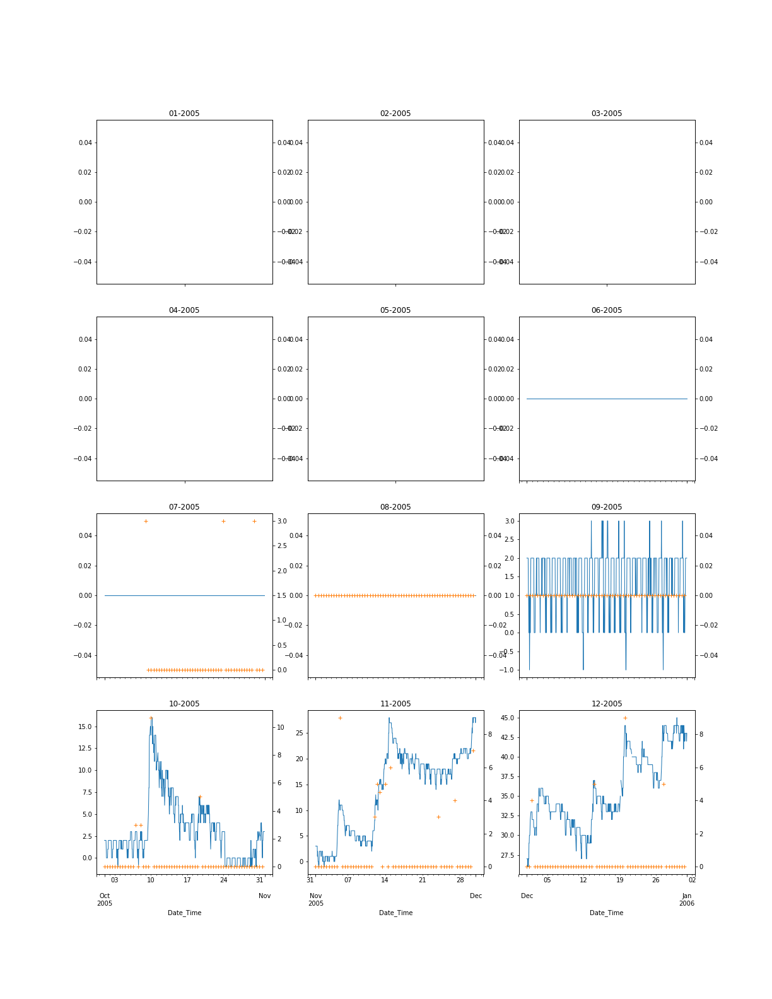

## Milestone Capstone:  
# Utilizing Meteorological Data with Supervised Learning to Predict Snowfall at Ski Resort
**By Dustin Rapp**  

--  
--  

## Introduction
***
Complex terrain in mountainous areas often make predicting snowfall difficult with prognostic weather models - especially on specific slopes or mountainsides where extremely localized air flows may complicate such forecasts.  With accurate snow forecasts, ski resorts can optimize their snowfall making, grooming, and snow removal operations. An accurate short term snowfall forecast, even for a small segment of the mountain may likely assist a ski resort's operation.  The goal of this study is to get a glimpse into the potential of utilizing a supervised learning techniques with freely available surface and meteorological data to predict snowfall on a slope at Copper Mountain Ski Resort in Colorado.  Copper Mountain Ski Resort may be especially interested in such predictive models because of the unique access to government funded meteorological data being recorded near or onsite to their resort.  

The purpose of this report is to discuss data to be utilized and make general assessment regarding how well a predictive model might perform. 

## Data
The Copper Mountain ski resort is unique as there is an official SNOTEL National Resources Conservation Service monitoring station the north slope of Copper Mountain, where many popular ski runs are located. SNOTEL is an telemtry automated system of snowpack and related climate sensors in the Western United States. In addition to reporting hourly snowfall amounts, it also records temperature.  The Copper Mountain ski resort is also has an Colorado Department of Transportation Automated Weather Observing System (AWOS) which monitors a suite of hourly variables near the top of Copper Mountain.  Additionally, a National Weather Service Automated Surface Observing Station (ASOS) is located in Leadville, CO approximately 30 km to the northwest of Copper Mountain.  These three stations give a comprehensive meteorological dataset of surface variables in the vicinity of the Copper Mountain Resort.   **Table 1-1** gives a listing of all surface level meteorological variables by station. Hourly data for each station was downloaded for years 2005-2017 from online sources.  Data sources for each station are found in **Table 2**.  

A map showing the Copper Mountain SNOTEL site and the meteorological sites used in this assessment is also shown in **Figure 1**  
  
**Insert Figure 1 - Map of Locations**  
  

  

***

**Table 1 - Meteorological Variables by Station[^foo].**  
  
| SNOTEL        | LXV ASOS       | KCCU AWOS      |        
|     :---:     |     :---:      |       ---:     |
| Temperature   | Temperature    | Temperature    |
| Snow Depth    | Dewpoint       | Dewpoint       |
|               | Wind Speed     | Wind Speed     |  
|               | Wind Direction | Wind Direction | 
|               | Cloud Cover    | Cloud Cover    | 
  

***

**Table 2 - Sources of Meteorological Data.** 

| Station | Data Source                                                           |
|-------- |---------------------------------------------------------------------- |
|  SNOTEL | National Resources Conservation Service (www.NRCS.gov)                |   
|LXV ASOS | National Climatitic Data Center - ISHD Lite format (www.NCDC.gov)     |
|KCCU AWOS| National Climatitic Data Center (ISHD format) (www.NCDC.gov)          |

## Data and Wrangling Cleaning

### Data Organization
Hourly surface data from each station was organized into timeseries dataframes with UTM timestamps.  While the KCCU and KXLV datasets were already in UTM time, the NRCS dataset was in local time and required conversion to UTM. The KCCU and KXLV datasets are in the Integrated Surface Hourly Data (ISHD) format did require some manipulation (e.g. divided by 10) to get values into typical units. Missing values (e.g. 9999 values) were tranlated to NaN values as well.  Missing data for all variables was linearly interpolated for time periods where 3 hours or less of data was missing.  The data was then plotted to see if there were any anomalous values.

Some anomalous data was observed in the SNOTEL snow depth data.  Physically unrealistic readings (e.g. spikes in some of the snow depth data) were removed as well as extreme negative values.  

The three individual dataframes were merged into a single timeseries dataframe with one value per variable each hour. 

### Additional Calculations

**Pressure**
Changes in pressure are often a predictive indicator of weather conditions (i.e. pressure drops often accompany strong storm systems), a twelve hour pressure change variable was added to the datset.  This was calcuated by subtracting the 00:00 observation from the upcoming 12:00 observation.

**Snowfall**
As the SNOTEL data only includes snow depth data instead of snowfall data, snowfall was caluclated based on changes in snowdepth. Due to the sensitivity of the SNOTEL snow depth measurement to external forces (e.g. debris, air pressure), snow depth data from the SNOTEL site appeared noisy for smaller snowstorms (i.e. less then 3 inches). To minimize the small scale pertubations found in the data, 12 hour snowfall totals were estimated at 00:00 UTC and 12:00 UTC and only 12-hr snowfall events where greater then or equal to 3 inches occurred were utilized.  The snowfall data was then added to meteorological dataframe.   

Because only 00:00 and 12:00 snowfall observations were utilized in the analysis, all variables in the meteorological dataframe were reduced from hourly observations to twelve hour observations.  A new dataframe was created utilizing only 00:00 and 12:00 observations.

A table showing the total number of snowfall events, along with mean and max snowfall for each year is found in **Table 3**.  A timeseries plot showing the snowdepth, along with these snowfall events is found in **Figure 2**.
  

***

**Table 3  Statistics on Snowfall Events To be Used in Analysis**  

|   Year |  Number 12hr Snowfall Events >=3" |      Mean |   Max |
|--------|-----------------------------------|-----------|-------|
|   2006 |                                25 |   4.8     |  11   |
|   2007 |                                28 |   3.96429 |   6.5 |
|   2008 |                                27 |   4.46296 |   8   |
|   2009 |                                27 |   4.25309 |  13   |
|   2010 |                                29 |   4.60345 |   9   |
|   2011 |                                 - |       -   |  -    |
|   2012 |                                14 |   5.14286 |  10   |
|   2013 |                                32 |   4.2875  |  12   |
|   2015 |                                24 |   4.125   |   8   |
|   2016 |                                31 |   4.93548 |  16   |
|   2017 |                                26 |   4.61538 |  16   |
  

***

**Insert Figure 2  Timeseries of snow depth and snowfall events**  
 

## Linear Regression Analysis  

To assess snowfall prediction potential with Ordinary Least Squares model, a linear regresssion analysis was performed on each dataset.  For each potential variable, data was plotted against snowfall amounts which would occur over the next 12 hours.    Slope, standard error, R square values, along with p values were calculated for all variables.  A table showing results from this analysis are shown in **Table 3**.  Note that the variables with the best predictive capabilities are dewpoint, KCCU Wind Speed, and pressure changes. While the R values are not noteably high (all are less then 0.2), p values for dewpoint, 12-hr pressure change are less then 0.05, indicating that there may be some predictive skill with an OLS model.
  

***

**Table 3 - Output statistics from Linear Regression Analysis**  

|                                                |   Slope |   Std Error |   R Value |   P-value |   % Missing |
|------------------------------------------------|---------|-------------|-----------|-----------|-------------|
| KCCU Temperature                               |   0.01  |       0.033 |     0.063 |     0.277 |       0     |
| KCCU Temperature                               |   0.012 |       0.033 |     0.067 |     0.31  |       0.228 |
| KCCU Dewpoint                                  |   0.017 |       0.033 |     0.166 |     0.012 |       0.228 |
| KCCU Wind Direction                            |   0.024 |       0.002 |     0.042 |     0.528 |       0.248 |
| KCCU Wind Speed                                |   0.03  |       0.037 |     0.128 |     0.055 |       0.248 |
| KCCU Cloud Cover                               |  -0.077 |       0.09  |     0.151 |     0.107 |       0.614 |
| SNOTEL Temperature                             |  -0.015 |       0.033 |     0.063 |     0.277 |       0     |
| KLXV Temperature                               |  -0.006 |       0.026 |     0.063 |     0.276 |       0     |
| KLXV Dewpoint                                  |  -0.007 |       0.032 |     0.132 |     0.023 |       0     |
| KLXV Pressure                                  |  -0.001 |       0.016 |    -0.045 |     0.443 |       0.003 |
| KLXV Wind Direction                            |  -0.007 |       0.001 |    -0.061 |     0.296 |       0     |
| KLXV Wind Speed                                |   0.002 |       0.055 |     0.002 |     0.975 |       0     |
| KLXV Cloud Cover                               |   0.007 |       0.059 |     0.123 |     0.137 |       0.5   |
| KLXV 12hr Pressure Change                      |  -0.051 |       0.024 |    -0.121 |     0.037 |       0.003 |

## Conclusion
While not large, there are some significant relationshps between some meteorological variables and snowfall amount when snowfall does occur.  It is anticipated that there may be some predictive ability predicting snowfall amounts over the next twelve hours utilizing a very simple Ordinary Least Squares model hourly meteorological measurements at the top of that twelve hour period.  Additional data sources, such as upper air measurements could be utilized to improve preditive ability.  

<!--stackedit_data:
eyJoaXN0b3J5IjpbMjE0MjM1MzQ3MywtNjk5ODA1MTM3LDc1OD
cxMTQ4XX0=
-->